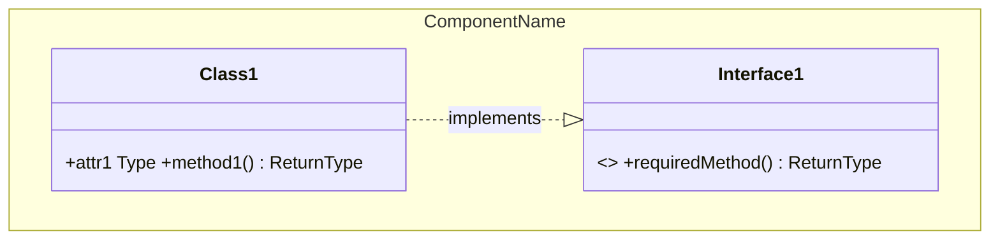
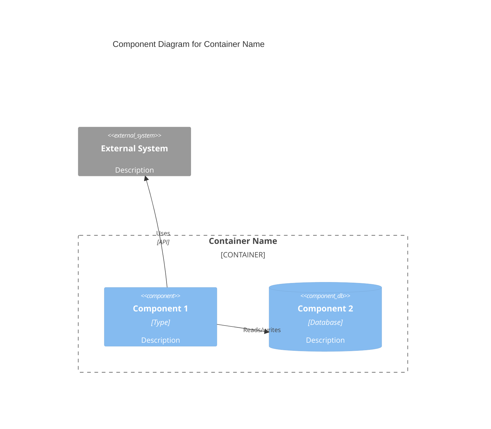
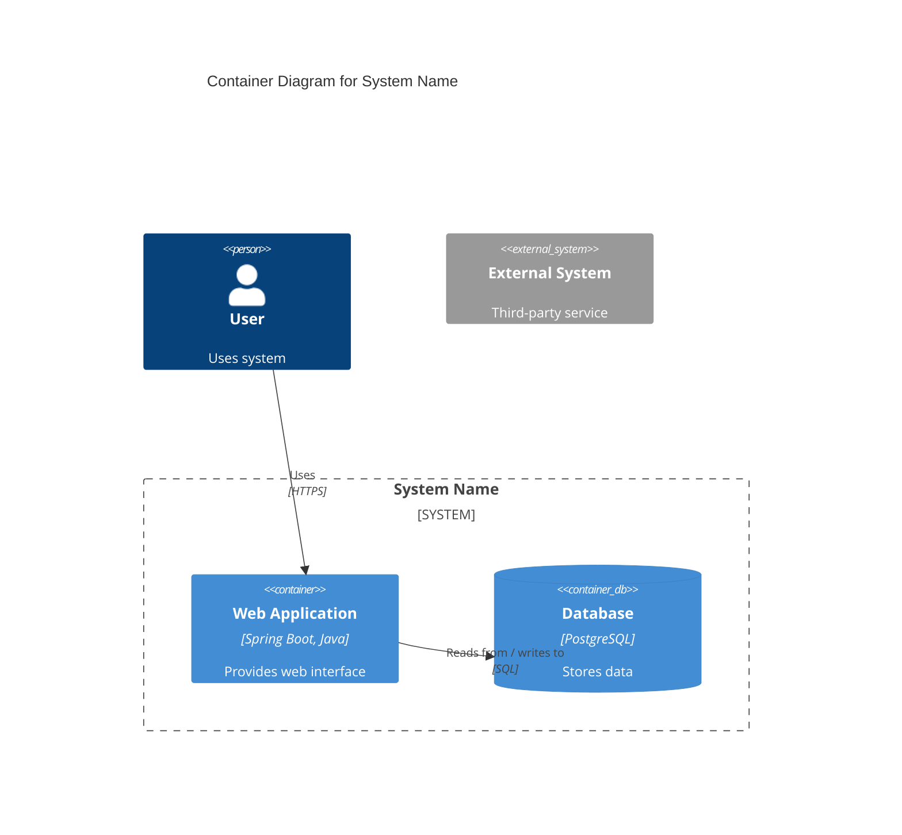
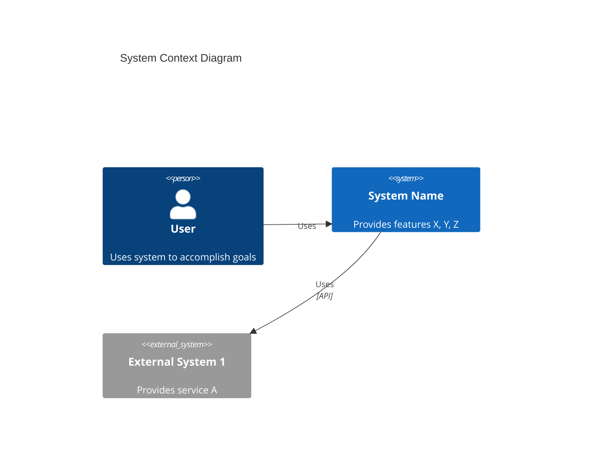

# C4 Architecture Documentation

Produces [C4 model](https://c4model.com/diagrams) documentation (Context → Container → Component → Code) for an existing repository using **bottom-up analysis**: start at the deepest code directories, document upward, then synthesize. Not every level is required — Context + Container is enough for most teams; generate Code/Component only when requested or genuinely useful.

All output goes to a new `C4-Documentation/` directory at the repo root.

## Workflow (bottom-up, 4 phases)

### Phase 1 — Code level
1. Enumerate subdirectories, sorted deepest-first. Skip `node_modules`, `.git`, `build`, `dist`, etc.
2. For each directory, document: functions/methods (name, typed params, return type, description, `file:line`, dependencies), classes/modules (name, description, location, methods, dependencies), internal vs external dependencies, and an optional Mermaid `classDiagram` for OOP code (or a module-structure `classDiagram` for functional/procedural code).
3. Save as `C4-Documentation/c4-code-<sanitized-dir-name>.md` (one per directory).

### Phase 2 — Component level
1. Read all `c4-code-*.md` files; group them into logical components by domain, technical, or ownership boundaries.
2. Per component, document: Overview (name, description, type, technology), Purpose, Software Features, Code Elements (links to the `c4-code-*.md` files it contains), Interfaces (protocol, description, operations), Dependencies (other components, external systems), and a `C4Component` Mermaid diagram scoped to **one container**.
3. Save as `C4-Documentation/c4-component-<name>.md`, plus a master index `C4-Documentation/c4-component.md` listing all components with a combined relationship diagram.

### Phase 3 — Container level
1. Read all component docs; find deployment definitions (Dockerfiles, K8s manifests, Terraform/CloudFormation, CI/CD configs) to map components onto actual deployment units.
2. Per container, document: Overview (name, description, type, technology, deployment), Purpose, Components deployed, Interfaces/APIs, Dependencies (other containers, external systems, protocols), Infrastructure (deployment config link, scaling, resources), and a `C4Container` Mermaid diagram.
3. For every container API, write an OpenAPI 3.1+ spec to `C4-Documentation/apis/<container-name>-api.yaml` (endpoints, request/response schemas, auth, error responses).
4. Save as `C4-Documentation/c4-container.md`.

### Phase 4 — Context level
1. Read container + component docs plus README/architecture/requirements docs.
2. Document: System Overview (short + long description), Personas (human, programmatic, or external-system "users" — type, description, goals, key features used), System Features (per feature: description, which personas use it, link to its journey), User Journeys (step-by-step per feature×persona, including integration journeys for programmatic users), External Systems Dependencies (type, description, integration type, purpose), and a `C4Context` Mermaid diagram.
3. Keep this level stakeholder-friendly — people and systems, not technology/protocol detail.
4. Save as `C4-Documentation/c4-context.md`.

## Mermaid templates









## Key principles per level
- **Code**: complete signatures, real `file:line` links, both internal and external dependencies.
- **Component**: logical grouping within **one container**; expose interfaces, not implementation.
- **Container**: high-level technology choices and deployment units; every API gets an OpenAPI spec.
- **Context**: people and systems only — no protocols or tech stack; must read as a non-technical stakeholder.

## Output structure
```
C4-Documentation/
├── c4-code-*.md          # one per source directory
├── c4-component-*.md     # one per component
├── c4-component.md       # master component index + relationship diagram
├── c4-container.md       # all containers + API links
├── c4-context.md         # personas, journeys, system context
└── apis/
    └── <container>-api.yaml
```

## Coordination notes
- Process strictly deepest-directory-first; every directory needs a `c4-code-*.md` before synthesis starts.
- Each level is synthesized only from the level below it — don't skip ahead.
- Keep cross-links between files consistent (code → component → container → context).
- Use proper C4-flavored Mermaid syntax (`C4Context`, `C4Container`, `C4Component`), not generic flowcharts.

## When invoked as `/c4-architecture:c4-architecture`
Runs all 4 phases end-to-end and writes the full `C4-Documentation/` tree described above.
