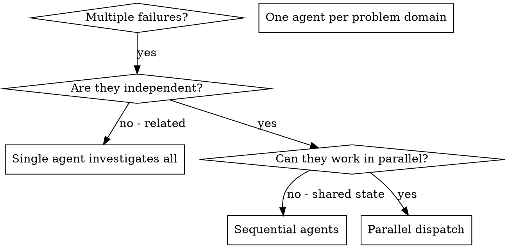

# Dispatching Parallel Agents

## Overview

When you have multiple unrelated failures (different test files, different subsystems, different bugs), investigating them sequentially wastes time. Each investigation is independent and can happen in parallel.

**Core principle:** Dispatch one agent per independent problem domain. Let them work concurrently.

## When to Use



**Use when:**
- 3+ test files failing with different root causes
- Multiple subsystems broken independently
- Each problem can be understood without context from others
- No shared state between investigations

**Don't use when:**
- Failures are related (fix one might fix others)
- Need to understand full system state
- Agents would interfere with each other

## The Pattern

### 1. Identify Independent Domains

Group failures by what's broken:
- File A tests: Tool approval flow
- File B tests: Batch completion behavior
- File C tests: Abort functionality

Each domain is independent - fixing tool approval doesn't affect abort tests.

### 2. Create Focused Agent Tasks

Each agent gets:
- **Specific scope:** One test file or subsystem
- **Clear goal:** Make these tests pass
- **Constraints:** Don't change other code
- **Expected output:** Summary of what you found and fixed

### 3. Dispatch in Parallel

```typescript
// In Claude Code / AI environment
Task("Fix agent-tool-abort.test.ts failures")
Task("Fix batch-completion-behavior.test.ts failures")
Task("Fix tool-approval-race-conditions.test.ts failures")
// All three run concurrently
```

### 4. Review and Integrate

When agents return:
- Read each summary
- Verify fixes don't conflict
- Run full test suite
- Integrate all changes

---

## Variant: Fan-Out for Planning (not for partitioned work)

Everything above assumes the work **partitions** — three agents, three test files,
no overlap. Planning does not partition. Every drafter is looking at the same
problem, so fan-out buys nothing unless the drafts actually differ.

They will not differ by default. Undifferentiated agents given the same prompt and
the same context converge on the same plan — same decomposition, same ordering, same
blind spots — and three agreeing drafts feel like corroboration while being one draft
sampled three times. **Divergence has to be engineered.**

### Assign each drafter an orthogonal bias

Spawn at least three, each with a named, different optimization target:

| Drafter | Bias | Optimizes for |
|---|---|---|
| A | **Fewest slices** | The smallest number of independently shippable pieces |
| B | **Risk-first** | Ordering so the plan dies fast if a core assumption is wrong |
| C | **Seam quality** | Clean boundaries between pieces, even at the cost of more of them |

Rules that make this work:

- **Keep them blind to each other.** Fresh context each, own worktree, no drafter
  sees another's output. One shared draft collapses the whole exercise back to one
  opinion.
- **Diversify by vendor family, not by model tier.** Different families have
  genuinely different priors. Dropping one drafter to a weaker model of the *same*
  family does not buy independence — it buys a worse version of the same opinion,
  and its disagreements are noise rather than signal.
- **Give each the same problem and the same context.** Only the bias differs, or you
  cannot tell whether divergence came from the bias or the briefing.

### Synthesize, don't pick a winner

The orchestrator's job is to build the canonical plan itself, using the drafts as
evidence:

- **Where drafts independently agree** → firm ground. Adopt it and stop thinking
  about it.
- **Where they disagree** → the load-bearing decisions. This is the map of where to
  concentrate, and it is the actual product of the fan-out.

Anointing one draft as the winner throws away exactly the information the fan-out was
run to produce. The synthesized plan will usually match no single draft.

Then re-inspect the highest-risk slice as its own feature. If it hides several
unknowns at once, or contains any variant of "we'll figure that out during
implementation," it is not a slice yet — reslice it and repeat.

Before calling the plan done, sweep the conversation for decisions that exist only in
chat and never made it into a written artifact, and mark superseded planning
documents as superseded. A fresh agent reading a stale plan is misrouted by it, and
it has no way to know.

## Agent Prompt Structure

Good agent prompts are:
1. **Focused** - One clear problem domain
2. **Self-contained** - All context needed to understand the problem
3. **Specific about output** - What should the agent return?

```markdown
Fix the 3 failing tests in src/agents/agent-tool-abort.test.ts:

1. "should abort tool with partial output capture" - expects 'interrupted at' in message
2. "should handle mixed completed and aborted tools" - fast tool aborted instead of completed
3. "should properly track pendingToolCount" - expects 3 results but gets 0

These are timing/race condition issues. Your task:

1. Read the test file and understand what each test verifies
2. Identify root cause - timing issues or actual bugs?
3. Fix by:
   - Replacing arbitrary timeouts with event-based waiting
   - Fixing bugs in abort implementation if found
   - Adjusting test expectations if testing changed behavior

Do NOT just increase timeouts - find the real issue.

Return: Summary of what you found and what you fixed.
```

## Common Mistakes

**❌ Too broad:** "Fix all the tests" - agent gets lost
**✅ Specific:** "Fix agent-tool-abort.test.ts" - focused scope

**❌ No context:** "Fix the race condition" - agent doesn't know where
**✅ Context:** Paste the error messages and test names

**❌ No constraints:** Agent might refactor everything
**✅ Constraints:** "Do NOT change production code" or "Fix tests only"

**❌ Vague output:** "Fix it" - you don't know what changed
**✅ Specific:** "Return summary of root cause and changes"

## When NOT to Use

**Related failures:** Fixing one might fix others - investigate together first
**Need full context:** Understanding requires seeing entire system
**Exploratory debugging:** You don't know what's broken yet
**Shared state:** Agents would interfere (editing same files, using same resources)

## Real Example from Session

**Scenario:** 6 test failures across 3 files after major refactoring

**Failures:**
- agent-tool-abort.test.ts: 3 failures (timing issues)
- batch-completion-behavior.test.ts: 2 failures (tools not executing)
- tool-approval-race-conditions.test.ts: 1 failure (execution count = 0)

**Decision:** Independent domains - abort logic separate from batch completion separate from race conditions

**Dispatch:**
```
Agent 1 → Fix agent-tool-abort.test.ts
Agent 2 → Fix batch-completion-behavior.test.ts
Agent 3 → Fix tool-approval-race-conditions.test.ts
```

**Results:**
- Agent 1: Replaced timeouts with event-based waiting
- Agent 2: Fixed event structure bug (threadId in wrong place)
- Agent 3: Added wait for async tool execution to complete

**Integration:** All fixes independent, no conflicts, full suite green

**Time saved:** 3 problems solved in parallel vs sequentially

## Key Benefits

1. **Parallelization** - Multiple investigations happen simultaneously
2. **Focus** - Each agent has narrow scope, less context to track
3. **Independence** - Agents don't interfere with each other
4. **Speed** - 3 problems solved in time of 1

## Verification

After agents return:
1. **Review each summary** - Understand what changed
2. **Check for conflicts** - Did agents edit same code?
3. **Run full suite** - Verify all fixes work together
4. **Spot check** - Agents can make systematic errors

## Real-World Impact

From debugging session (2025-10-03):
- 6 failures across 3 files
- 3 agents dispatched in parallel
- All investigations completed concurrently
- All fixes integrated successfully
- Zero conflicts between agent changes

## Parallel Builder Safety

The patterns above apply to investigations. Parallel *builders* (agents writing code) need stricter rules.

**Default: one main builder per repo.** Multiple builders writing to the same files cause conflicts, partial overwrites, and one worker silently undoing another's work.

**Add parallelism only across clear write boundaries:**
- Different repos
- Different branches
- Git worktrees (each builder gets its own worktree)
- Separate packages in a monorepo
- Docs vs. code
- Tests vs. implementation

**Bad pattern:** Three builders all editing the same files in the same repo. You get conflicts and work lost with no warning.

**Competing approaches pattern:** When you want genuine parallelism on the same feature, spin N builders in N separate git worktrees working on N competing approaches. Let the orchestrator (or you) pick the best result and discard the rest. Reviewers are always read-only — they never need their own worktree.
