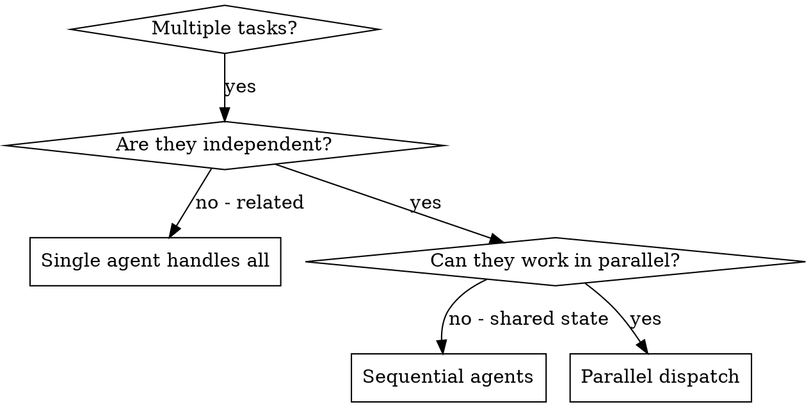

# Dispatching Parallel Agents

## Overview

When you have multiple unrelated failures (different test files, different subsystems, different bugs) or multiple independent angles on one task, investigating sequentially wastes time. Dispatch one agent per independent problem domain and let them work concurrently.

## When to Use


```dot
digraph when_to_use {
    "Multiple tasks?" [shape=diamond];
    "Are they independent?" [shape=diamond];
    "Single agent handles all" [shape=box];
    "Can they work in parallel?" [shape=diamond];
    "Sequential agents" [shape=box];
    "Parallel dispatch" [shape=box];

    "Multiple tasks?" -> "Are they independent?" [label="yes"];
    "Are they independent?" -> "Single agent handles all" [label="no - related"];
    "Are they independent?" -> "Can they work in parallel?" [label="yes"];
    "Can they work in parallel?" -> "Parallel dispatch" [label="yes"];
    "Can they work in parallel?" -> "Sequential agents" [label="no - shared state"];
}
```

**Use when:** 3+ test files failing with different root causes; multiple subsystems broken independently; each problem is understandable without context from others; multiple expertise domains needed (security + performance + quality); no shared state between investigations.

**Don't use when:** failures are related (fixing one might fix others — investigate together first); you need to understand full system state; exploratory debugging where you don't know what's broken yet; agents would interfere with each other (same files, same resources).

## The Pattern

1. **Identify independent domains** — group by what's broken. Fixing tool approval shouldn't touch abort-logic tests.
2. **Create focused agent tasks** — each agent gets a specific scope, a clear goal, explicit constraints ("don't change other code"), and a defined output (summary of what was found/fixed).
3. **Dispatch in parallel** — invoke all agents in the same turn so they run concurrently, not one after another.
4. **Review and integrate** — read each summary, verify fixes don't conflict, run the full test/verification suite, then integrate.

## Native Agent Invocation Patterns

- **Single:** "Use the security-auditor agent to review authentication"
- **Sequential chain:** "First use explorer to map structure. Then use backend-specialist to review endpoints. Finally use test-engineer to find gaps." — use when each step's output shapes the next agent's scope.
- **With context passing:** "Use frontend-specialist to analyze components. Based on those findings, have test-engineer generate tests."
- **Resume:** "Resume agent [agentId] and continue with additional requirements."

**Claude Code built-in agents** (always available alongside any project-specific ones):

| Agent | Model | Purpose |
|---|---|---|
| **Explore** | Haiku | Fast read-only codebase search |
| **Plan** | Sonnet | Research during plan mode |
| **General-purpose** | Sonnet | Complex multi-step modifications |

Use Explore for quick lookups; reach for domain-specific agents (if the project defines them) for specialist work.

## Variant: Fan-Out for Planning (not for partitioned work)

The pattern above assumes work **partitions** — N agents, N independent pieces, no overlap. Planning does not partition: every drafter looks at the same problem, so fan-out buys nothing unless the drafts actually differ. Undifferentiated agents given the same prompt and context converge on the same plan — same decomposition, same blind spots — and three agreeing drafts feel like corroboration while being one draft sampled three times. **Divergence has to be engineered.**

### Assign each drafter an orthogonal bias

Spawn at least three, each with a named, different optimization target:

| Drafter | Bias | Optimizes for |
|---|---|---|
| A | **Fewest slices** | Smallest number of independently shippable pieces |
| B | **Risk-first** | Ordering so the plan dies fast if a core assumption is wrong |
| C | **Seam quality** | Clean boundaries between pieces, even at the cost of more of them |

Rules that make this work:
- **Keep them blind to each other** — fresh context each, own worktree, no drafter sees another's output. One shared draft collapses the exercise back to one opinion.
- **Diversify by vendor family, not model tier** — dropping one drafter to a weaker model of the *same* family doesn't buy independence; its disagreements are noise, not signal.
- **Give each the same problem and context** — only the bias differs, or you can't tell whether divergence came from the bias or the briefing.

### Synthesize, don't pick a winner

Build the canonical plan from the drafts as evidence: where drafts independently agree → firm ground, adopt and stop thinking about it. Where they disagree → the load-bearing decisions — this is the actual product of the fan-out. Anointing one draft as "the winner" throws away the information the fan-out was run to produce; the synthesized plan should usually match no single draft.

Then re-inspect the highest-risk slice as its own feature. If it hides several unknowns at once, or contains any variant of "we'll figure that out during implementation," reslice it and repeat. Before calling the plan done, sweep the conversation for decisions that exist only in chat and never made it into a written artifact, and mark superseded planning documents as superseded — a fresh agent reading a stale plan has no way to know it's stale.

## Agent Prompt Structure

Good agent prompts are **focused** (one clear problem domain), **self-contained** (all context needed, no "see above"), and **specific about output** (what exactly should the agent return?).

```markdown
Fix the 3 failing tests in src/agents/agent-tool-abort.test.ts:
1. "should abort tool with partial output capture" - expects 'interrupted at' in message
2. "should handle mixed completed and aborted tools" - fast tool aborted instead of completed
3. "should properly track pendingToolCount" - expects 3 results but gets 0

These are timing/race condition issues. Your task:
1. Read the test file and understand what each test verifies
2. Identify root cause - timing issue or actual bug?
3. Fix by replacing arbitrary timeouts with event-based waiting; fix abort bugs if found

Do NOT just increase timeouts - find the real issue.
Return: Summary of what you found and what you fixed.
```

## Common Mistakes

| Mistake | Fix |
|---|---|
| "Fix all the tests" — agent gets lost | "Fix agent-tool-abort.test.ts" — focused scope |
| "Fix the race condition" — agent doesn't know where | Paste the error messages and test names |
| No constraints — agent refactors everything | "Do NOT change production code" / "Fix tests only" |
| "Fix it" — vague output, unclear what changed | "Return summary of root cause and changes" |

## Synthesis Protocol

After all agents complete, synthesize one unified report — never ship separate per-agent outputs:

```markdown
## Orchestration Synthesis
### Task Summary
[What was accomplished]
### Agent Contributions
| Agent | Finding |
|---|---|
| security-auditor | Found X |
### Consolidated Recommendations
1. **Critical**: [Issue from Agent A]
2. **Important**: [Issue from Agent B]
### Action Items
- [ ] Fix critical issue
- [ ] Add missing tests
```

## Verification

1. Review each agent's summary — understand what changed.
2. Check for conflicts — did agents edit the same code?
3. Run the full suite — verify all fixes work together, not just individually.
4. Spot check — agents can make systematic errors; a clean summary isn't proof.

## Real Example (2025-10-03)

6 test failures across 3 files after a major refactor, split into 3 independent domains (abort logic, batch completion, race conditions) and dispatched as 3 parallel agents. Results: Agent 1 replaced timeouts with event-based waiting; Agent 2 fixed an event-structure bug (threadId in wrong place); Agent 3 added a wait for async tool execution to complete. All fixes were independent, zero conflicts, full suite green — 3 problems solved in the time of 1.

## Parallel Builder Safety

The patterns above apply to investigations. Parallel **builders** (agents writing code) need stricter rules.

**Default: one main builder per repo.** Multiple builders writing to the same files cause conflicts, partial overwrites, and one worker silently undoing another's work.

**Add parallelism only across clear write boundaries:** different repos, different branches, git worktrees (each builder gets its own), separate packages in a monorepo, docs vs. code, tests vs. implementation.

**Bad pattern:** three builders all editing the same files in the same repo — conflicts and lost work with no warning.

**Competing approaches pattern:** for genuine parallelism on the same feature, spin N builders in N separate git worktrees working on N competing approaches. Let the orchestrator (or you) pick the best result and discard the rest. Reviewers are always read-only — they never need their own worktree.
